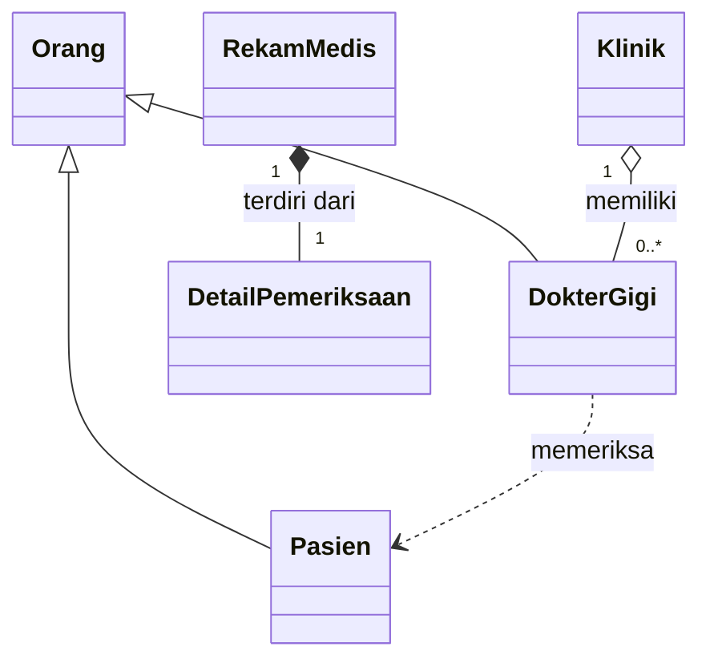

# Dental Medical Record - Posttest 2

Project ini lanjutan dari Posttest 1 dengan tema **Healthy Smile Dental Clinic**.
Sekarang programnya upgrade dikit karena sudah pakai UML relationship dan
inheritance, tapi flow-nya tetap simple dan gampang.

## Class Setup

- `Orang` jadi superclass buat data umum.
- `Pasien` dan `DokterGigi` jadi subclass dari `Orang`.
- `Klinik` nyimpan daftar dokter.
- `RekamMedis` nyimpan data pemeriksaan pasien.
- `DetailPemeriksaan` jadi bagian internal dari rekam medis.

## UML Relationship



Relasi yang dipakai:

- **Asosiasi:** `DokterGigi` memakai objek `Pasien` lewat method `periksa()`.
- **Agregasi:** objek dokter dibuat sendiri, lalu dimasukin ke dalam `Klinik`.
- **Komposisi:** `DetailPemeriksaan` dibuat langsung di dalam `RekamMedis`.

## Inheritance Stuff

`Pasien` dan `DokterGigi` sama-sama pakai `super().__init__()` buat ngambil data
dari class `Orang`. Masing-masing juga punya data unik:

- `Pasien` punya `id_pasien` dan `umur`.
- `DokterGigi` punya `id_dokter` dan `spesialisasi`.

Method `tampil()` dari `Orang` di-override supaya output pasien dan dokter punya
format yang beda.

## Access Level

- `_nomor_telepon` dibuat protected karena dipakai langsung oleh subclass.
- `__nik` dibuat private dan cuma ditampilin dalam bentuk tersensor.
- `__biaya` juga private, jadi update nilainya wajib lewat setter.

Kalau biaya bukan angka atau nilainya minus, setter bakal reject datanya.

## How to Run

Buka terminal di folder `POSTTEST-2`, terus run:

```bash
python 2509106045-Athasyahri-Syawal-Fahrezy-PT2.py
```

## Quick Test

Pas dijalankan, program bakal show:

1. Inheritance dan method overriding.
2. Dokter memeriksa pasien sebagai asosiasi.
3. Klinik punya daftar dokter sebagai agregasi.
4. Rekam medis punya detail pemeriksaan sebagai komposisi.
5. Class method dan static method.
6. Setter dengan nilai valid dan nilai minus.

That's it. Tetap simple, tapi semua requirement sudah masuk.